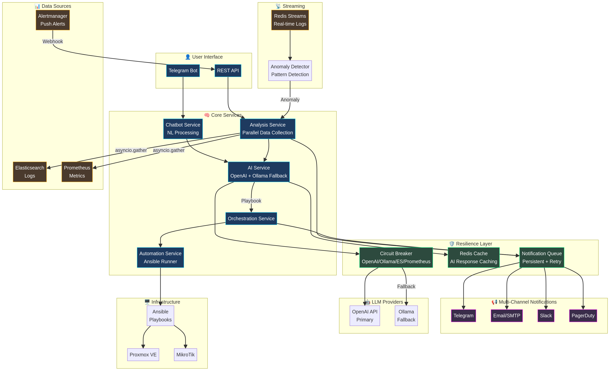
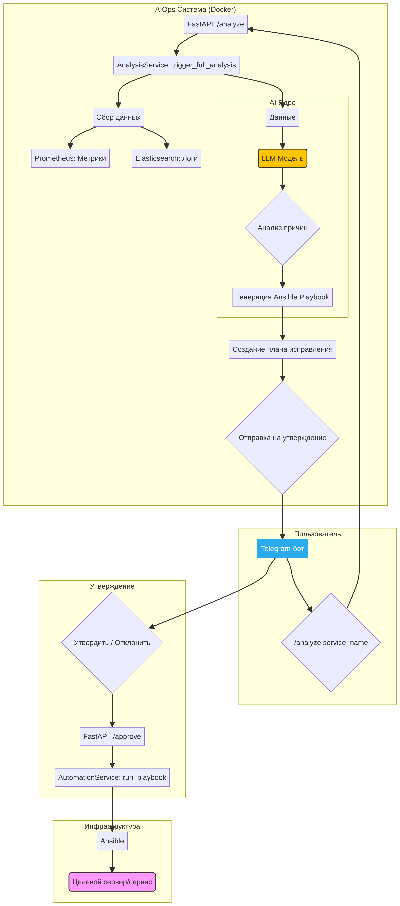

# 🛡️ AIOps Platform

<div align="center">


**Интеллектуальная платформа для автоматизированного мониторинга и управления IT-инфраструктурой**

[Быстрый старт](#-быстрый-старт) • [Архитектура](#-архитектура) • [Документация](#-документация) • [API](#-api-reference)

</div>

---

## 📋 Содержание

- [Обзор](#-обзор)
- [Ключевые возможности](#-ключевые-возможности)
- [Архитектура](#-архитектура)
- [Быстрый старт](#-быстрый-старт)
- [Конфигурация](#-конфигурация)
- [Использование](#-использование)
- [API Reference](#-api-reference)
- [Отказоустойчивость](#-отказоустойчивость)
- [Структура проекта](#-структура-проекта)
- [Документация](#-документация)
- [Разработка](#-разработка)

---

## 🎯 Обзор

AIOps Platform — это комплексное решение для автоматизации IT-операций с использованием искусственного интеллекта. Система анализирует логи и метрики, выявляет аномалии, определяет первопричины проблем и автоматически генерирует планы исправления.

### Для кого этот проект?

- **DevOps/SRE команды** — автоматизация рутинных задач мониторинга
- **Малый и средний бизнес** — замена дорогостоящих специалистов
- **IT-аутсорсинг** — масштабирование поддержки без увеличения штата

---

## ✨ Ключевые возможности

| Функция | Описание |
|---------|----------|
| 🔍 **AI-анализ логов** | Автоматическое обнаружение аномалий и определение root cause с помощью LLM |
| 📊 **Мониторинг метрик** | Интеграция с Prometheus, Elasticsearch для сбора данных |
| 🤖 **Генерация плейбуков** | Автоматическое создание Ansible-плейбуков для исправления проблем |
| 💬 **Telegram-бот** | Управление системой и утверждение действий через мессенджер |
| 🔄 **Self-healing** | Автоматическое исправление типовых проблем без участия человека |
| 🛡️ **Отказоустойчивость** | Circuit Breaker, Fallback на локальную LLM, Redis кэширование |
| 📢 **Multi-channel уведомления** | Telegram, Email, Slack, PagerDuty |
| 🖥️ **Интеграции** | Proxmox VE, MikroTik RouterOS, Ansible |

---

## 🏗️ Архитектура

### Общая схема



### Компоненты системы

```
┌─────────────────────────────────────────────────────────────────┐
│                        ПОЛЬЗОВАТЕЛЬ                              │
│                      (Telegram Bot)                              │
└─────────────────────────────┬───────────────────────────────────┘
                              │
┌─────────────────────────────▼───────────────────────────────────┐
│                     API GATEWAY (FastAPI)                        │
│  • REST API endpoints                                            │
│  • Webhook handlers (Alertmanager)                               │
│  • Health checks                                                 │
└─────────────────────────────┬───────────────────────────────────┘
                              │
        ┌─────────────────────┼─────────────────────┐
        │                     │                     │
        ▼                     ▼                     ▼
┌───────────────┐    ┌───────────────┐    ┌───────────────┐
│  AI Service   │    │   Analysis    │    │  Automation   │
│               │    │   Service     │    │   Service     │
│ • OpenAI API  │    │ • Log collect │    │ • Ansible     │
│ • Ollama      │    │ • Metrics     │    │ • Proxmox     │
│ • Caching     │    │ • Streaming   │    │ • MikroTik    │
└───────────────┘    └───────────────┘    └───────────────┘
        │                     │                     │
        └─────────────────────┼─────────────────────┘
                              │
┌─────────────────────────────▼───────────────────────────────────┐
│                      DATA LAYER                                  │
│  ┌─────────┐  ┌─────────┐  ┌─────────┐  ┌─────────┐            │
│  │  Redis  │  │Elastic- │  │Prometheus│  │ Milvus  │            │
│  │ (Cache) │  │ search  │  │(Metrics) │  │(Vectors)│            │
│  └─────────┘  └─────────┘  └─────────┘  └─────────┘            │
└─────────────────────────────────────────────────────────────────┘
```

### Детальная схема потоков



---

## 🚀 Быстрый старт

### Предварительные требования

- Docker и Docker Compose v2.0+
- Python 3.11+ (для локальной разработки)
- 4GB RAM минимум (8GB рекомендуется)
- (Опционально) NVIDIA GPU для локальной LLM

### 1. Клонирование репозитория

```bash
git clone https://github.com/sileade/aiops-project.git
cd aiops-project
```

### 2. Конфигурация

```bash
# Копируем пример конфигурации
cp .env.example .env

# Редактируем .env файл
nano .env
```

**Минимальная конфигурация:**

```env
# Telegram Bot (обязательно)
TELEGRAM_TOKEN=your_bot_token_from_botfather
ADMIN_CHAT_ID=your_telegram_chat_id

# OpenAI API (обязательно)
OPENAI_API_KEY=your_openai_api_key
OPENAI_MODEL=gpt-4.1-mini
```

### 3. Запуск

```bash
# Запуск всех сервисов
docker-compose up -d

# Проверка статуса
docker-compose ps

# Просмотр логов
docker-compose logs -f api
```

### 4. Проверка работоспособности

```bash
# Health check API
curl http://localhost:8000/health

# Или через Telegram бота
# Отправьте команду /status
```

---

## ⚙️ Конфигурация

### Переменные окружения

<details>
<summary><b>🔐 Основные настройки</b></summary>

| Переменная | Описание | По умолчанию |
|------------|----------|--------------|
| `TELEGRAM_TOKEN` | Токен Telegram бота | — |
| `ADMIN_CHAT_ID` | Chat ID администратора | — |
| `API_HOST` | Хост API сервера | `0.0.0.0` |
| `API_PORT` | Порт API сервера | `8000` |
| `DEBUG` | Режим отладки | `false` |

</details>

<details>
<summary><b>🤖 LLM настройки</b></summary>

| Переменная | Описание | По умолчанию |
|------------|----------|--------------|
| `OPENAI_API_KEY` | API ключ OpenAI | — |
| `OPENAI_BASE_URL` | Base URL для OpenAI-совместимого API | `https://api.openai.com/v1` |
| `OPENAI_MODEL` | Модель OpenAI | `gpt-4.1-mini` |
| `ENABLE_LLM_FALLBACK` | Включить fallback на Ollama | `true` |
| `OLLAMA_BASE_URL` | URL Ollama сервера | `http://ollama:11434/v1` |
| `OLLAMA_MODEL` | Модель Ollama | `llama3.2` |

</details>

<details>
<summary><b>💾 Кэширование</b></summary>

| Переменная | Описание | По умолчанию |
|------------|----------|--------------|
| `ENABLE_CACHING` | Включить Redis кэширование | `true` |
| `REDIS_URL` | URL Redis сервера | `redis://redis:6379/0` |
| `CACHE_TTL_ANALYSIS` | TTL кэша анализа (сек) | `600` |
| `CACHE_TTL_PLAYBOOK` | TTL кэша плейбуков (сек) | `1800` |
| `CACHE_TTL_NL` | TTL кэша NL команд (сек) | `300` |

</details>

<details>
<summary><b>🛡️ Circuit Breaker</b></summary>

| Переменная | Описание | По умолчанию |
|------------|----------|--------------|
| `CB_FAILURE_THRESHOLD` | Порог ошибок для открытия CB | `3` |
| `CB_TIMEOUT` | Таймаут до перехода в half-open (сек) | `60` |
| `CB_SUCCESS_THRESHOLD` | Успешных запросов для закрытия | `2` |

</details>

<details>
<summary><b>📢 Уведомления</b></summary>

| Переменная | Описание | По умолчанию |
|------------|----------|--------------|
| `ENABLE_EMAIL_NOTIFICATIONS` | Включить Email | `false` |
| `SMTP_HOST` | SMTP сервер | — |
| `SMTP_PORT` | SMTP порт | `587` |
| `SMTP_USER` | SMTP пользователь | — |
| `SMTP_PASSWORD` | SMTP пароль | — |
| `ENABLE_SLACK_NOTIFICATIONS` | Включить Slack | `false` |
| `SLACK_WEBHOOK_URL` | Slack Webhook URL | — |
| `ENABLE_PAGERDUTY` | Включить PagerDuty | `false` |
| `PAGERDUTY_ROUTING_KEY` | PagerDuty routing key | — |

</details>

---

## 📱 Использование

### Команды Telegram бота

| Команда | Описание |
|---------|----------|
| `/start` | Начало работы, проверка доступа |
| `/status` | Полный отчет о состоянии системы |
| `/analyze <service>` | Запустить анализ для сервиса |
| `/pending` | Показать планы, ожидающие утверждения |
| `/approve <plan_id>` | Утвердить план исправления |
| `/reject <plan_id>` | Отклонить план |
| `/help` | Справка по командам |

### Пример рабочего процесса

```
1. Система обнаруживает аномалию в логах
                    ↓
2. AI анализирует проблему и определяет root cause
                    ↓
3. Генерируется Ansible-плейбук для исправления
                    ↓
4. Администратор получает уведомление в Telegram
                    ↓
5. После утверждения (/approve) плейбук выполняется
                    ↓
6. Результат отправляется в Telegram
```

---

## 📡 API Reference

### Endpoints

#### Health Check
```http
GET /health
```

**Response:**
```json
{
  "status": "healthy",
  "version": "2.0.0",
  "components": {
    "api": "ok",
    "redis": "ok",
    "elasticsearch": "ok"
  }
}
```

#### Analyze Service
```http
POST /api/v1/analyze
Content-Type: application/json

{
  "service_name": "api-gateway",
  "time_range": "1h"
}
```

#### Alertmanager Webhook
```http
POST /webhook/alertmanager
Content-Type: application/json

{
  "alerts": [...]
}
```

#### Circuit Breaker Status
```http
GET /api/v1/circuit-breakers
```

---

## 🛡️ Отказоустойчивость

Система спроектирована с учетом высокой доступности и graceful degradation.

### Механизмы защиты

| Механизм | Описание |
|----------|----------|
| **Circuit Breaker** | Защита от каскадных сбоев. После 3 ошибок сервис блокируется на 60 секунд. |
| **LLM Fallback** | При недоступности OpenAI автоматическое переключение на локальную Ollama. |
| **Redis Caching** | Кэширование ответов AI для экономии ресурсов и ускорения повторных запросов. |
| **Graceful Degradation** | При полном отказе LLM система продолжает работать в ограниченном режиме. |
| **Retry with Backoff** | Автоматические повторные попытки с экспоненциальной задержкой. |
| **Message Queue** | Redis очередь для гарантированной доставки уведомлений. |

### Тестирование отказоустойчивости

```bash
# Запуск демонстрации
python3 tests/test_resilience_demo.py

# Автоматический режим
python3 tests/test_resilience_demo.py --non-interactive
```

**Результаты тестирования:** см. [reports/resilience_demo_report.html](reports/resilience_demo_report.html)

---

## 📁 Структура проекта

```
aiops-project/
├── app/                          # Основное приложение
│   ├── api/                      # API endpoints
│   ├── models/                   # Pydantic модели
│   ├── services/                 # Бизнес-логика
│   │   ├── ai_service.py         # LLM интеграция (OpenAI/Ollama)
│   │   ├── analysis_service.py   # Сбор и анализ данных
│   │   ├── automation_service.py # Ansible автоматизация
│   │   ├── cache_service.py      # Redis кэширование
│   │   ├── chatbot_service.py    # NL обработка команд
│   │   ├── notification_service.py # Multi-channel уведомления
│   │   ├── orchestration_service.py # Оркестрация выполнения
│   │   ├── proxmox_service.py    # Proxmox VE интеграция
│   │   ├── mikrotik_service.py   # MikroTik интеграция
│   │   └── streaming_service.py  # Redis Streams обработка
│   ├── utils/                    # Утилиты
│   │   ├── circuit_breaker.py    # Circuit Breaker паттерн
│   │   └── logger.py             # Логирование
│   └── main.py                   # FastAPI приложение
├── bot/                          # Telegram бот
│   └── main.py                   # Обработчики команд
├── config/                       # Конфигурация
│   ├── settings.py               # Настройки приложения
│   ├── prometheus.yml            # Конфигурация Prometheus
│   └── alertmanager.yml          # Конфигурация Alertmanager
├── data/                         # Данные
│   ├── logs/                     # Логи
│   └── playbooks/                # Ansible плейбуки
├── reports/                      # Отчеты
│   ├── resilience_demo_report.html
│   └── key_takeaways.md
├── scripts/                      # Скрипты
│   └── extract_key_takeaways.py  # Парсер отчетов
├── tests/                        # Тесты
│   └── test_resilience_demo.py   # Демо отказоустойчивости
├── docker-compose.yml            # Docker оркестрация
├── Dockerfile                    # Сборка образа
├── requirements.txt              # Python зависимости
└── .env.example                  # Пример конфигурации
```

---

## 📚 Документация

| Документ | Описание |
|----------|----------|
| [QUICKSTART.md](QUICKSTART.md) | Быстрый старт |
| [SETUP.md](SETUP.md) | Детальная настройка |
| [DATABASE_DOCUMENTATION.md](DATABASE_DOCUMENTATION.md) | Схема базы данных |
| [LOG_ANALYSIS_ARCHITECTURE.md](LOG_ANALYSIS_ARCHITECTURE.md) | Архитектура анализа логов |
| [AI_CHATBOT_GUIDE.md](AI_CHATBOT_GUIDE.md) | Руководство по чат-боту |
| [CICD_DOCUMENTATION.md](CICD_DOCUMENTATION.md) | CI/CD пайплайн |
| [EXAMPLES.md](EXAMPLES.md) | Примеры использования |

---

## 🔧 Разработка

### Локальный запуск

```bash
# Создание виртуального окружения
python3 -m venv venv
source venv/bin/activate

# Установка зависимостей
pip install -r requirements.txt

# Запуск API
uvicorn app.main:app --reload --host 0.0.0.0 --port 8000

# Запуск бота (в отдельном терминале)
python bot/main.py
```

### Запуск тестов

```bash
# Тест отказоустойчивости
python3 tests/test_resilience_demo.py

# Извлечение Key Takeaways из отчета
python3 scripts/extract_key_takeaways.py
```

### Полезные команды

```bash
# Пересборка контейнеров
docker-compose up --build -d

# Просмотр логов конкретного сервиса
docker-compose logs -f api

# Остановка всех сервисов
docker-compose down

# Очистка volumes
docker-compose down -v
```

---

## 🤝 Участие в разработке

Мы приветствуем любой вклад! 

1. Fork репозитория
2. Создайте feature branch (`git checkout -b feature/amazing-feature`)
3. Commit изменений (`git commit -m 'Add amazing feature'`)
4. Push в branch (`git push origin feature/amazing-feature`)
5. Откройте Pull Request

---

## 📄 Лицензия

Этот проект распространяется под лицензией MIT. См. файл [LICENSE](LICENSE) для подробностей.

---

<div align="center">

**[⬆ Наверх](#-aiops-platform)**

Made with ❤️ by AIOps Team

</div>
